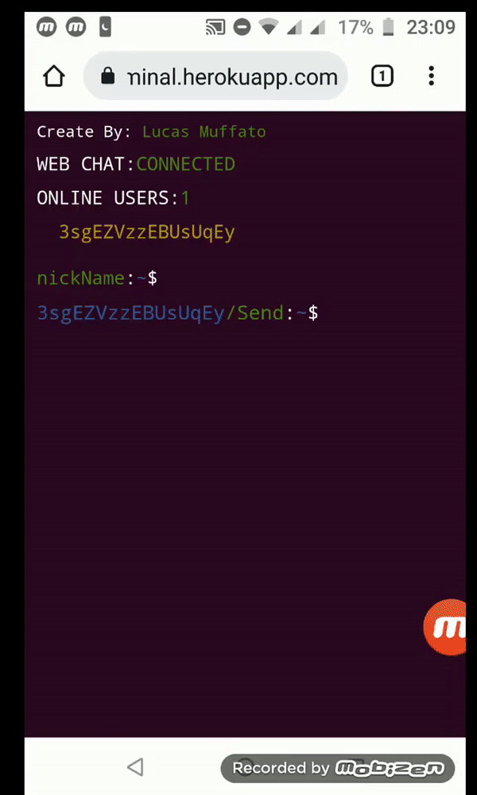
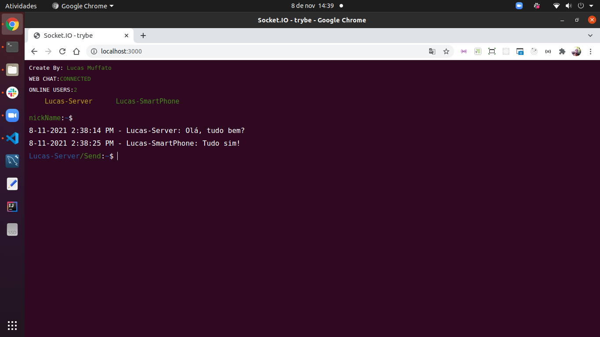

# Aplicação de chat online com o visual do terminal do Ubunto 20.04 LTS



#### Link da Aplicação Online
A aplicação teve o deploy no Heroku, e pode ser acessa online pelo link abaixo:</br>
https://webchat-terminal.herokuapp.com</br>

## Funcionalidades:

### 1. Lista de usuários conectados
Quando conectado, o nome do usuário é gerado automaticamente pelos 16 primeiros caracteres do id da conexão fornecido pelo socket.</br>
Obs.: O nome do usuário sempre é mostrado no topo da lista, na cor amarela. Os nomes dos demais usuários é exibido de a ordem de conexão.</br></br>

### 2. Personalizar o nome de usuário
Para alterar o nome do usuário, basta clicar na frente do `nickName:~$`, digitar o nome, e clicar no `nickName:~$` ou apertar enter.</br></br>

### 3. Enviar mensagem no chat
Para enviar uma mensagem, basta clicar na frente do `/Send:~$`, escrever o nome e clicar no `/Send:~$` ou apertar enter.</br>
Obs.: O nome atrás do `/Send~$` muda de acordo com o nome do usuário</br></br>

### 4. Design responsivo
O visual da aplicação é responsivo, se adaptando a proporção da tela de monitores e smartphones.</br></br>

# Para executar localmente

#### 1. Clone o projeto
```
git clone git@github.com:lmuffato/web-chat-terminal-ubunto.git;
```

#### 2. Entre na pasta:
```
cd web-chat-terminal-ubunto;
```

#### 3. Instale as dependências:;
```
npm install
```

#### 4. Iniciando a aplicação

#### 4.1. Modo normal:
```
node index.js
```

ou

#### 4.2 Modo de desenvolvimento:
```
npm run dev
```
</br>

# Utilizando o chat na rede local
Para acessar o chat em uma rede, seja por uma rede Wifi ou por cabeamento, basta ir na barra de url do navegador e digitar o ip da máquina que está executando o código e a porta.



No linux, você pode descobrir o ip da máquina pelo seguite comando:
```
ifconfig
```

No meu caso, o ip da máquina que está executando a aplicação é `192.168.2.104` e a porta utilizada é a `3000`.

```
192.168.2.104:3000
```
E pronto, agora qualquer um da rede pode conversar no chat.


</br></br>

# Alterando a porta da aplicação
A configuração da porta utilizada pela aplicação é feita na variável de ambiente que deve ficar na raiz da pasta.

Quando você fizer o clone do projeto, não encontrará esse arquivo, pois ele está listado no .gitignore, uma vez que este arquivo normalmente é utilizado para armazenar informações sensíveis, como senhas ou chaves de criptografia.
Apesar de não ser o caso, é bom manter o hábito 😉.
</br></br>

### Criando e configurando a variável de ambiente
Vá na raiz do projeto e crie um arquivo `.env`, e depois coloque o seguinte conteúdo dentro do arquivo:
```
PORT=3000
```

O arquivo index.js busca a constante PORT dentro do arquivo `.env`, e caso ele não encontre, ele usa a porta `3000` por padrão.  

# Informações adicionais
Eu desenvolvi essa aplicação para desenvovler e treinar algumas habilidades, ou seja, é uma aplicação para fins didáticos e não comerciais. Por isso alguns arquivos, existem trechos de código comentados, de alguns recursos e estilos que não estão habilitados na aplicação em funcionamento.

A função desses trechos comentados, é servir de resumo e lembrente (pra mim e para qualquer um que esteja olhando o código) de como utilizar esses funcionalidades.
</br>

